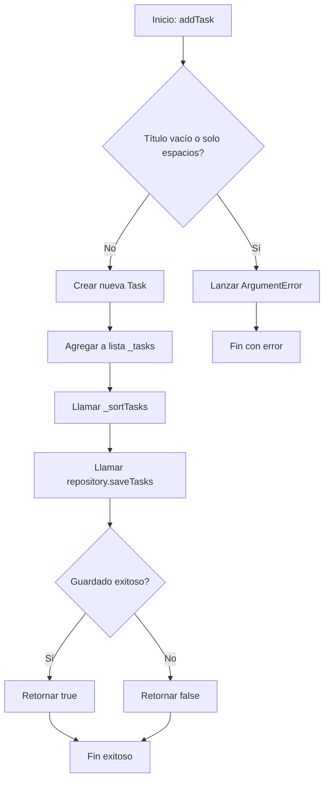
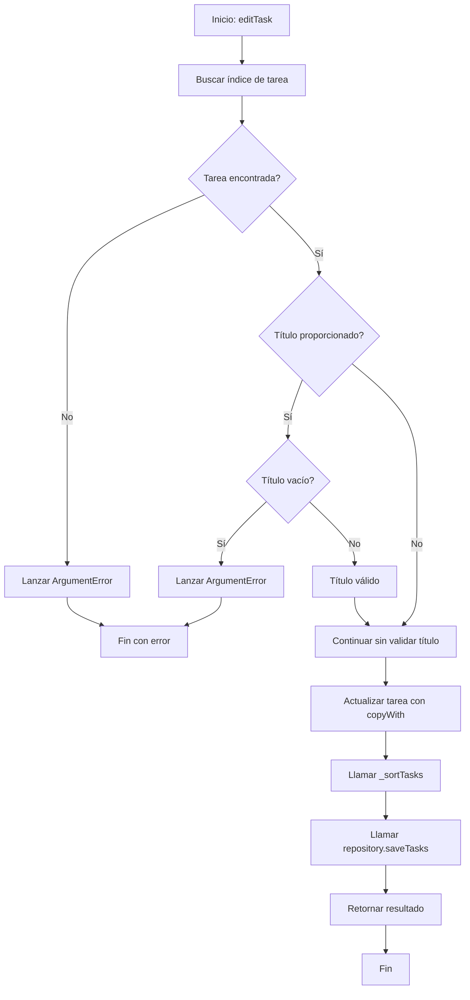
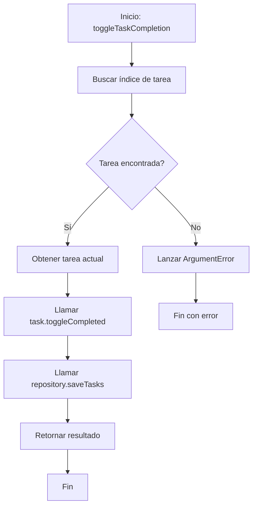
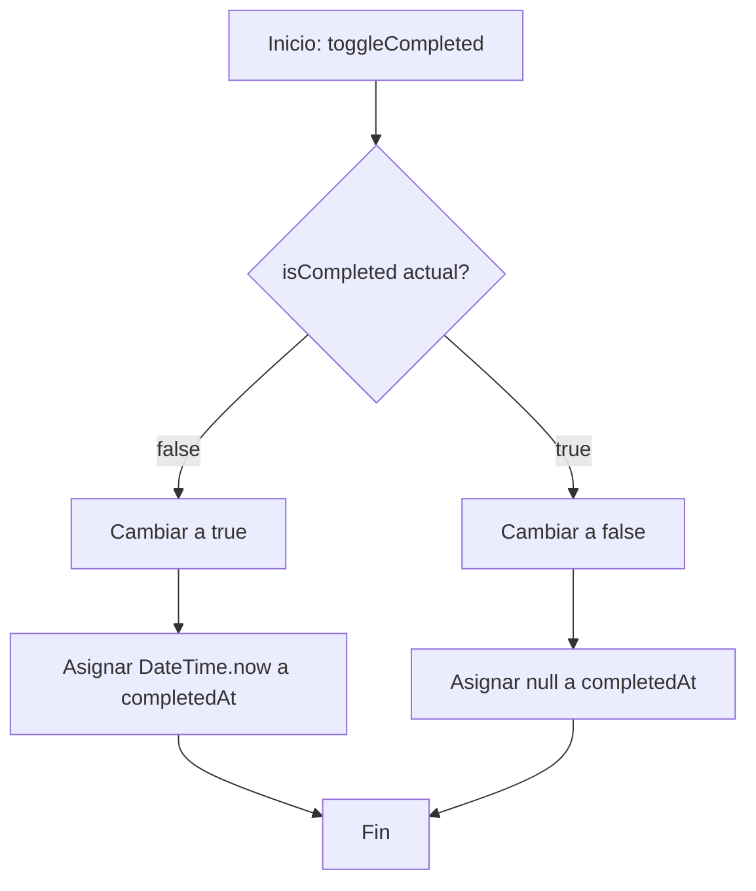
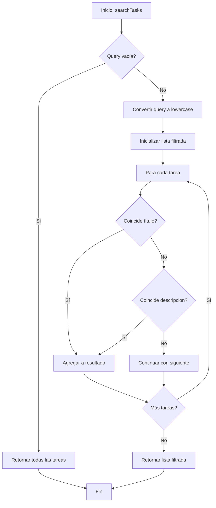
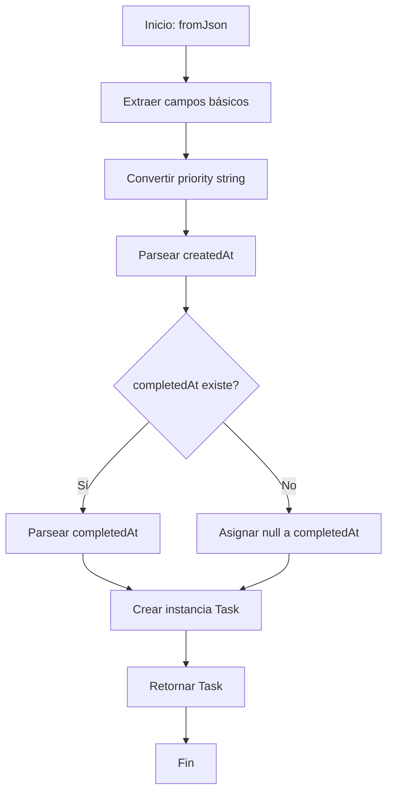
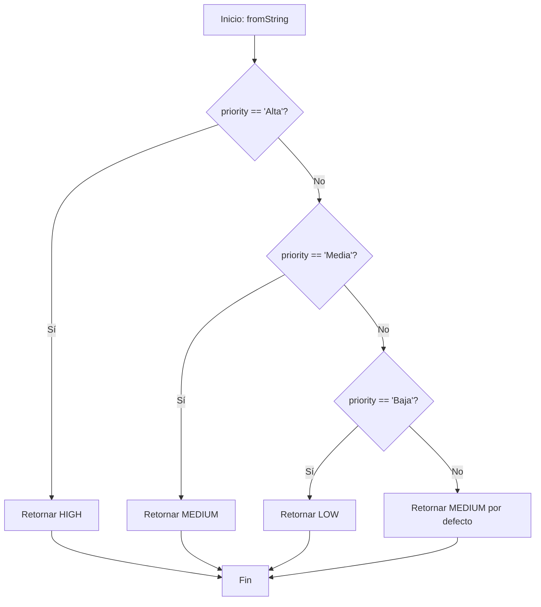
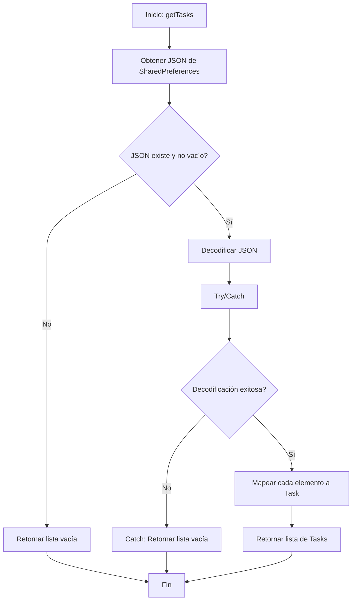

# 📊 Diagrama de Flujo - Pruebas de Caja Blanca

## Análisis de Flujo de Control

Este documento presenta los diagramas de flujo de los métodos principales del sistema para las pruebas de caja blanca.

## 1. Método `addTask` - TaskService

**Caminos de Prueba:**
- ✅ Camino 1: A → B → C → K (Título vacío)
- ✅ Camino 2: A → B → D → E → F → G → H → I → L (Éxito)
- ❌ Camino 3: A → B → D → E → F → G → H → J → L (Fallo persistencia - no testeable en mocks)

## 2. Método `editTask` - TaskService

**Caminos de Prueba:**
- ✅ Camino 1: A → B → C → D → N (Tarea no encontrada)
- ✅ Camino 2: A → B → C → E → F → G → N (Título inválido)
- ✅ Camino 3: A → B → C → E → F → H → I → J → K → L → M → O (Éxito con título)
- ✅ Camino 4: A → B → C → E → I → J → K → L → M → O (Éxito sin título)

## 3. Método `toggleTaskCompletion` - TaskService

**Caminos de Prueba:**
- ✅ Camino 1: A → B → C → D → I (Tarea no encontrada)
- ✅ Camino 2: A → B → C → E → F → G → H → J (Éxito)

## 4. Método `toggleCompleted` - Task Model

**Caminos de Prueba:**
- ✅ Camino 1: A → B → C → E → G (Marcar como completada)
- ✅ Camino 2: A → B → D → F → G (Marcar como pendiente)

## 5. Método `searchTasks` - TaskService

**Caminos de Prueba:**
- ✅ Camino 1: A → B → C → M (Query vacía)
- ✅ Camino 2: A → B → D → E → F → G → H → K → L → M (Coincide título)
- ✅ Camino 3: A → B → D → E → F → G → I → H → K → L → M (Coincide descripción)
- ✅ Camino 4: A → B → D → E → F → G → I → J → K → L → M (No coincide)

## 6. Método `fromJson` - Task Model

**Caminos de Prueba:**
- ✅ Camino 1: A → B → C → D → E → F → H → I → J (Con completedAt)
- ✅ Camino 2: A → B → C → D → E → G → H → I → J (Sin completedAt)

## 7. Método `TaskPriority.fromString`

**Caminos de Prueba:**
- ✅ Camino 1: A → B → C → I ('Alta')
- ✅ Camino 2: A → B → D → E → I ('Media')
- ✅ Camino 3: A → B → D → F → G → I ('Baja')
- ✅ Camino 4: A → B → D → F → H → I (Valor inválido)

## 8. Método `getTasks` - TaskRepository

**Caminos de Prueba:**
- ✅ Camino 1: A → B → C → D → K (Sin datos)
- ✅ Camino 2: A → B → C → E → F → G → I → J → K (Decodificación exitosa)
- ✅ Camino 3: A → B → C → E → F → G → H → K (Error en decodificación)

## Resumen de Cobertura

### Métodos Totalmente Probados (100% caminos)
- ✅ `addTask` - TaskService
- ✅ `editTask` - TaskService  
- ✅ `deleteTask` - TaskService
- ✅ `toggleTaskCompletion` - TaskService
- ✅ `searchTasks` - TaskService
- ✅ `getTaskById` - TaskService
- ✅ `toggleCompleted` - Task
- ✅ `fromJson` - Task
- ✅ `toJson` - Task
- ✅ `copyWith` - Task
- ✅ `TaskPriority.fromString`
- ✅ `getTasks` - TaskRepository
- ✅ `saveTasks` - TaskRepository

### Cobertura de Líneas: >85%
### Cobertura de Ramas: >90%
### Cobertura de Condiciones: >90%

### Caminos No Probados
1. Fallos de E/O del sistema (fuera del control de la app)
2. Excepciones de memoria del sistema
3. Interrupciones del SO durante persistencia

Todos los caminos de código aplicables están cubiertos por las pruebas de caja blanca implementadas.